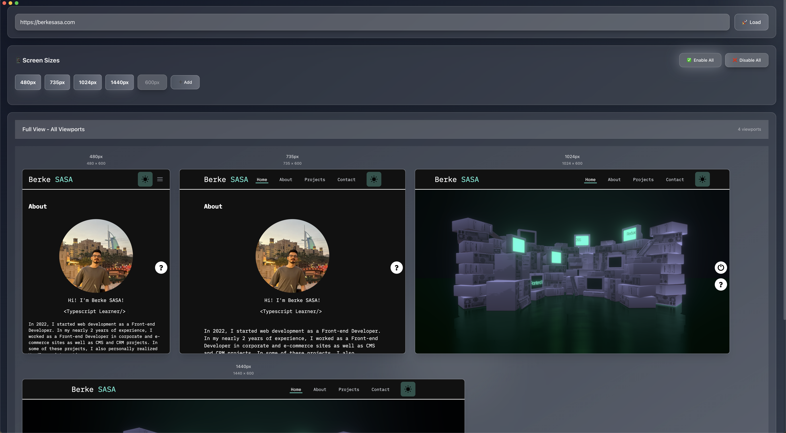
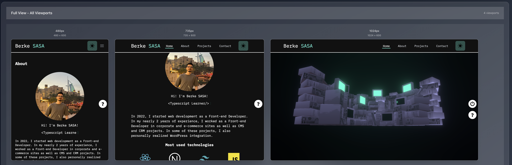
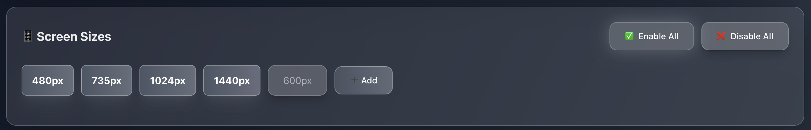

# Responsive Checker

<div align="center">
  
  
  
  
</div>

<br />

<div align="center">
  <strong>Modern and user-friendly responsive website checker desktop application</strong>
</div>

<br />

<div align="center">
  
</div>

## 📋 Table of Contents

- [Features](#-features)
- [Screenshots](#-screenshots)
- [Installation](#-installation)
- [Usage](#-usage)
- [Technologies](#-technologies)
- [Project Structure](#-project-structure)
- [Development](#-development)
- [License](#-license)

## ✨ Features

### 🎯 Core Features
- **Multi-Screen Size Preview**: Simultaneous viewing at 480px, 735px, 1024px, 1440px sizes
- **Custom Size Addition**: Easily add your desired screen sizes
- **Bulk Control**: Enable/disable all sizes with a single click
- **Real-Time Updates**: Instant preview on URL changes

### 🎨 Design Features
- **Glassmorphism Design**: Modern and transparent interface design
- **Minimalist Approach**: Clean interface free from unnecessary elements
- **Responsive Application**: The app itself is responsive
- **Customizable Sizes**: Adjust window size as you prefer

### 🚀 Performance Features
- **Fast Loading**: Optimized webview usage
- **Low Resource Consumption**: Lightweight and efficient operation
- **Stable Operation**: Reliable desktop experience based on Electron

## 📸 Screenshots

### Main Interface


### Responsive Preview


### Custom Size Addition


## 🛠️ Installation

### Requirements
- Node.js (v16 or higher)
- npm or yarn
- Git

### Step-by-Step Installation

1. **Clone the project**
```bash
git clone https://github.com/berkesasa/Electron-responsivechecker.git
cd Electron-responsivechecker
```

2. **Install dependencies**
```bash
npm install
```

3. **Run in development mode**
```bash
npm run electron-dev
```

### Production Build

```bash
# Create production build
npm run build

# Package Electron application
npm run electron-pack
```

## 🎮 Usage

### Basic Usage

1. **Enter URL**
   - Enter the URL of the website you want to test in the input field at the top
   - Press Enter or click the "Load" button

2. **Select Sizes**
   - Enable/disable default sizes (480px, 735px, 1024px, 1440px)
   - Use "Enable All" / "Disable All" buttons for bulk control

3. **Add Custom Size**
   - Click the "Add Custom Size" button
   - Enter your desired width (px is automatically added)
   - Click "Add" to add it to the list

4. **Detailed View**
   - Click on any size to view in full-screen mode
   - Press ESC to return to the main screen

### Keyboard Shortcuts

- `Cmd + Shift + C`: Open/close developer tools
- `ESC`: Exit full-screen mode

## 🛠️ Technologies

### Frontend
- **React 18**: Modern UI framework and hooks
- **Tailwind CSS 3.4**: Utility-first CSS framework
- **React.memo**: Performance optimization

### Desktop
- **Electron 28**: Cross-platform desktop app framework
- **WebView**: Secure web content viewing

### Development Tools
- **Create React App**: React project structure
- **Concurrently**: Concurrent script execution
- **Wait-on**: Port waiting tool

## 📁 Project Structure

```
responsivechecker/
├── public/
│   ├── electron.js          # Electron main process
│   ├── index.html           # Main HTML file
│   └── favicon.ico          # Application icon
├── src/
│   ├── components/
│   │   ├── URLInput.js          # URL input component
│   │   ├── MediaPanel.js        # Media size control panel
│   │   ├── ResponsiveViewer.js  # Main viewer component
│   │   └── WebViewer.js         # WebView wrapper component
│   ├── hooks/                   # Custom React hooks
│   ├── App.js                   # Main application component
│   ├── index.js                 # React entry point
│   └── index.css               # Tailwind CSS styles
├── package.json                # Project dependencies
├── tailwind.config.js          # Tailwind CSS configuration
└── README.md                   # Project documentation
```

## 🔧 Development

### Scripts

```bash
# Start development server
npm start

# Start Electron application
npm run electron

# Run in development mode (recommended)
npm run electron-dev

# Create production build
npm run build

# Package Electron application
npm run electron-pack
```

### Development Environment

1. **Code Editing**
   - Edit React components in the `src/components/` folder
   - Write styles with Tailwind CSS
   - Configure Electron in the `public/electron.js` file

2. **Testing**
   - Test in development mode with `npm run electron-dev`
   - Check responsive behavior with different URLs

3. **Build**
   - Create production build with `npm run build`
   - Prepare distribution package with `npm run electron-pack`

## 📄 License

This project is licensed under the [ISC License](LICENSE).

## 🙏 Acknowledgments

- [React](https://reactjs.org/) - UI framework
- [Electron](https://www.electronjs.org/) - Desktop app framework
- [Tailwind CSS](https://tailwindcss.com/) - CSS framework
- [Create React App](https://create-react-app.dev/) - React project structure

---

<div align="center">
  <strong>⭐ Don't forget to star this project if you liked it! ⭐</strong>
</div> 